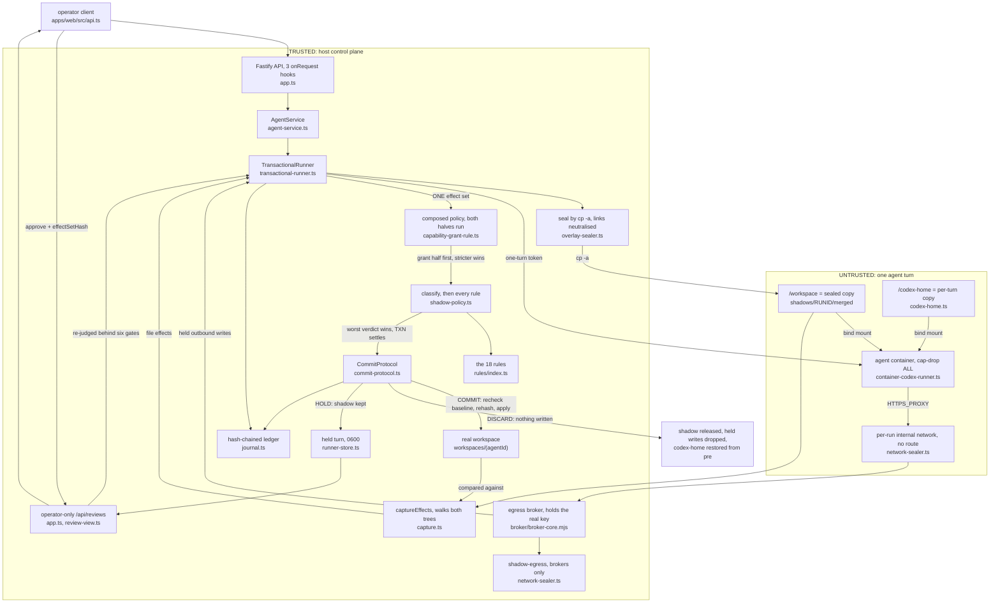

# Architecture

Shadow Commit runs every agent turn as a transaction. The turn executes against a sealed copy of the
workspace, its complete effect set is captured and judged, and the turn then commits, is discarded,
or is held for a person.

**Baseline.** This replaces the starter kit's page, which drew the platform before this work: UI to
API to Service to Runner to Container to Ark, with no transaction, seal, policy or ledger in it. It
was accurate about the kit and silent about the product. It is preserved, not deleted:
`git show 8d0bd4f:docs/ARCHITECTURE.md`, and every node it drew is named below or in the trust
boundary.

## One turn



**The seal is a copy, not an overlay.** Both mechanisms exist in `overlay-sealer.ts`, and copy is
what every documented run mode takes: `overlay-sealer.ts:466` returns copy on any non-Linux host
before probing, and on Linux the mount needs root or `CAP_SYS_ADMIN`, which no deployment file here
grants (four run modes, measured against the shipped `dist`, `research/overhead/AUDIT.md:70-86`).
Under copy the read witness (`read-witness.ts`) is armed every turn, and decides nothing by design.

**One effect set, one verdict.** The join is the `TransactionalRunner`, not either producer:
`capture.ts` returns the file effects and the runner appends the broker's held outbound writes to
that same array before calling the policy, so a turn's files, network writes and memory all move
together or none do. The policy is `withCapabilityGrantRule(store, defaultPolicy)`
(`capability-grant-rule.ts:268-278`): the authorization half runs first and reads no bytes, the
content half is `defaultPolicy`, and `stricterVerdict` keeps the worse. Classification is the first
thing that content half does, in place on each effect, and then the rules run. Inside
`shadow-policy.ts:42-55` there is no `break` and no `return`, so every rule runs over the whole
effect set every turn. Precisely: no hits means commit, any hit means at least review, a discard hit
means discard.

## Trust boundary

Inside: the Node process and what only it can reach. The real workspace and `codex-home`,
`data/launchpad.json`, the held and pending records, the ledger and its HMAC and Ed25519 keys (kept
outside the data directory and never inside a container), the real `ARK_API_KEY`, the operator's
identity, the rules and the capability grants. `index.ts` builds one `TransactionalRunner` and passes
it twice, as the runner and as the review surface: one node, two edges in. The broker is drawn on
this side because it holds the real key and it is the thing that decides, even though it is the only
trusted thing the turn can address. `shadow-egress` (`network-sealer.ts:93`) is how it reaches the
model provider, and deliberately not the default bridge: it carries brokers, never an agent.

Outside: the turn. A `docker run --rm --init` container, `--cap-drop ALL`,
`--security-opt no-new-privileges`, non-root, capped on cpu, memory and pids, seeing three things.
`/workspace`, a bind mount of the sealed copy with every outbound symlink already replaced by a
snapshot file. `/codex-home`, a per-turn copy with the restore source `pre` beside it and never
mounted. One `--internal` network with no default route whose only other member is the broker. Its
`ARK_API_KEY` is a per-run `shadow-turn-<48 hex>` token only the broker honours, and its cwd is the
fixed string `/workspace`, so a payload cannot read its own path and go inert because it is watched.

The review surface is operator-only twice over, in the `onRequest` hook and again in each handler,
because the turn's container sits on a docker bridge and can address the control plane at the
gateway address. Without that rule, a held turn approves itself.

**Approval is not a write.** `TransactionalRunner.approve` runs six gates before `CommitProtocol` is
called: no second decision in flight, the ledger still attests the `turn.held` record
(`attestsHeldTurn`, asked on this path alone, so deleting the record does not buy an approval), the
roots still resolve, the submitted `effectSetHash` matches, no held effect was tampered with on disk,
and the policy runs again on the held set at the moment it would land. That second judgement refuses
only on a discard verdict or hit, so a new review-class hit does not block: a person is already
looking. A baseline conflict check follows, so a workspace that moved during review refuses.

**The honest limit.** This holds in container mode with the network sealed. `runner-factory.ts:852`
refuses the unconfined host runtime and `runner-factory.ts:872` refuses container mode with the
network unsealed, each unless the operator sets `SHADOW_ALLOW_UNCONFINED=1`; take the first override
and every turn journals `confinement: "none"`, take the second and every turn journals
`network: null`. A clean-looking audit trail for something nothing contained is worse than none.
`docker compose up` cannot reach container mode at all: a turn needs its own container, and
`container-socket-guard.ts` refuses the docker socket mount repo-wide.

## Failure boundary

**The sealed copy cannot be made.** `compareCopy` walks the real tree against the copy, and a
non-directory present in the workspace but absent from the shadow throws `SealFailedError("copy-incomplete")`,
because capture would read that absence as a deletion by the agent. The throw unwinds in the
`TransactionalRunner.run` catch that settles the confinement as discard, releases or removes the
shadow, and rethrows. The turn never runs and nothing is written. A short read is survivable and
journals `seal.copy.degraded`.

**The policy throws.** Two layers, neither able to commit. One rule throwing is caught per rule at
`shadow-policy.ts:45` and becomes a `policy-rule-error` hit at `review`, so the other 17 rules still
run and a person sees the turn with the reason attached. The whole policy call throwing is caught in
`run`, which emits `policy.failed` and discards as `policy-failed`.

**The broker is unreachable.** At turn open `waitForBroker` throws after 20 s
(`network-sealer.ts:396`) onto the same unwind as a failed seal, so the turn is refused before the
agent starts. Mid-turn the agent's proxy calls fail inside the container, file effects are still
captured and judged, and there are no held records to add. The startup refusal at
`runner-factory.ts:872` exists because `container-codex-runner.ts:293` falls back to the real key
when no turn token was minted.

**The server dies mid-turn.** After the commit point it recovers: the single `turn.committing` append
follows `store.putPending`, and `CommitProtocol.reconcile()` replays that record. It starts in the
`TransactionalRunner` constructor and is awaited by `ready()`, which `run()` and both settle paths
call first, so no new turn is accepted until an interrupted commit finishes, and a replay that cannot
finish emits `commit.unrecoverable` rather than a clean commit. Before the commit point
nothing reached the real workspace, but the shadow directory is left behind and **nothing on the
product path sweeps it**. `overlay-sealer.ts:957 sweepOrphans` does exactly that job and is tested,
yet `runner-factory.ts:925` takes only `Pick<..., "seal" | "release">`, so it is dropped at the
composition site and called from tests alone. A crash-killed host leaks one shadow copy of the
workspace per interrupted turn until someone deletes it.

## Extension seam: adding a rule

The contract is five members, `apps/server/src/rules/rule.ts`:

```ts
export interface Rule {
  name: string;
  summary: string;                            // one line, in the words on the review card
  decisions: readonly RuleHit["decision"][];  // every decision this rule can return
  hitIds: readonly string[];                  // every id it reports under; trailing ":" is a prefix
  run(effects: EffectRecord[], ctx: PolicyContext): Promise<RuleHit[]>;
}
```

The last three make the rule set readable as a list rather than as source. `hitIds` exists because a
rule may report under another name, as `protected-identity` reports `protected-asset-delete`.

Add `apps/server/src/rules/<your-rule>.ts` exporting a `Rule` (either `export const rule` or
`export const yourRule`), fill all five members, return `RuleHit[]` with a `decision` of `review` or
`discard`, and register it in the `rules` array in `apps/server/src/rules/index.ts`. Read what you
need from `ctx`, built by `buildPolicyContext` (`policy-context.ts:753`): protected paths and inodes,
lazy readers for real and shadow content and added lines, the platform's own secrets, and the task
prompt. `apps/server/src/rules/registry-wiring.test.ts` fails if you wire it wrong: it reads the
directory from disk rather than a hand-written list, so a module missing from `index.ts`, a duplicate
name, a rule unreachable through the registry, or an id renamed in the code but not in `hitIds` each
fail a case. That gate exists because deleting `trojanSourceRule` from the array once left the whole
suite green.

## What this costs

A transaction per turn is not free, and judging the diff after the fact is not a stupid alternative.
The price is a full-tree copy plus two full-tree walks per turn: linear in repository size, not
constant. On the demo machine a no-op turn from open through commit is p50 40.4 ms at 50 files,
4,558 ms at 8,886 files and 25,639 ms at 30,000 files, a 635x growth over a 600x growth in file
count. Judging 1,000 effects against a real context is 38.6 ms. An allowed call through the broker
adds 0.23 ms p50, with eleven re-runs spread between 0.074 and 0.676 ms, so read it as a fraction of
a millisecond and not as a figure. What that buys is the property no post-hoc diff has: nothing
reaches the real workspace, the real network or the agent's memory before a verdict. Numbers,
harnesses, and an audit of which published figures were wrong are in `research/OVERHEAD.md` and
`research/overhead/AUDIT.md`.
